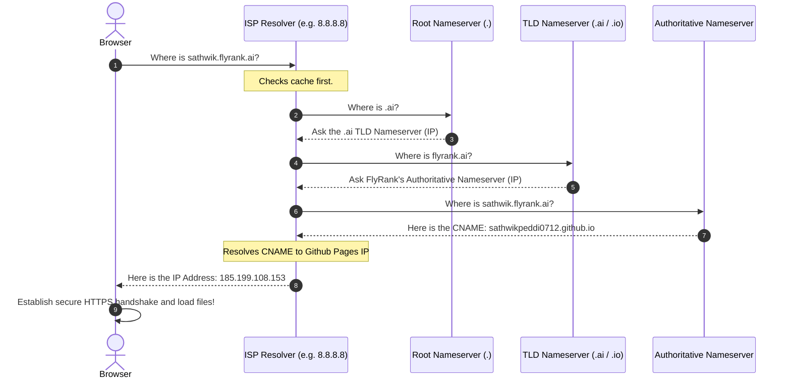

# DNS Walkthrough: How Your Browser Finds My Website
**Intern:** Sathwik Peddi | **Track:** General AI Fluency (ML Focus) | **Assignment:** PF-04

This document explains what happens under the hood when you type my portfolio address into your web browser, how domain names map to servers, and what a **CNAME record** does.

---

## 🗺️ 1. What is DNS? (The Phonebook of the Internet)

Computers don't understand human-readable web addresses like `sathwikpeddi0712.github.io` or `sathwik.flyrank.ai`. Instead, they locate each other using numeric **IP Addresses** (e.g., `185.199.108.153` for GitHub Pages). 

The **Domain Name System (DNS)** acts as the internet's phonebook, translating the easy-to-remember name you type into the number the computer needs to fetch the files.

---

## 🚀 2. The Step-by-Step DNS Resolution Query

When you type my address into your browser, a multi-step game of telephone happens in less than a fraction of a second:

### 1. The Browser Asks the Resolver
The browser asks your local **DNS Resolver** (usually run by your Internet Service Provider or public resolvers like Google's `8.8.8.8`): *"Do you know the IP address for `sathwik.flyrank.ai`?"* If the resolver has looked this up recently, it answers immediately from its local memory (cache). If not, the hunt begins.

### 2. The Resolver Asks the Root Nameserver
The resolver queries the **Root Nameservers** (represented by a dot `.`). The root doesn't know the specific IP, but it knows where to find the directors of the end extension. It responds: *"I don't know, but here is the IP for the `.ai` Top-Level Domain (TLD) nameservers."*

### 3. The Resolver Asks the TLD Nameserver
The resolver contacts the `.ai` **TLD Nameserver**. The TLD server answers: *"I don't know the exact site, but here is the IP for the authoritative nameservers of `flyrank.ai`."*

### 4. The Resolver Asks the Authoritative Nameserver
The resolver contacts the **Authoritative Nameserver** for `flyrank.ai` (managed by FlyRank's DNS provider, e.g. Cloudflare). This server holds the master zone file records. It reads the record for `sathwik.flyrank.ai` and responds: *"That address is a alias (CNAME) pointing to `sathwikpeddi0712.github.io`."*

### 5. Final IP Resolution
The resolver does a quick follow-up query for `sathwikpeddi0712.github.io`, gets back GitHub's hosting server IP address (e.g. `185.199.108.153`), and hands that IP back to your browser. Your browser establishes a secure HTTPS handshake and pulls the website files.

---

## 🏷️ 3. What is a CNAME Record?

A **CNAME (Canonical Name) Record** is an alias record. Instead of mapping a domain name directly to a hard-coded IP address (which is what an **A Record** does), a CNAME maps one domain name to another domain name.

### Why use a CNAME instead of an A Record?
If GitHub Pages moves their hosting servers to a different data center, their IP addresses will change.
*   If we used an **A Record** pointing directly to their old IPs, our website would break immediately until we manually updated our DNS records.
*   By using a **CNAME Record**, we tell the world: *"Go ask `sathwikpeddi0712.github.io` where the server is."* Since GitHub manages the records for `sathwikpeddi0712.github.io`, any changes they make automatically resolve for our custom subdomain without us lifting a finger.

### Our Subdomain Mapping Plan
At the end of the internship, when my capstone is approved, I will configure the following subdomain:
*   **Subdomain (Name):** `sathwik.flyrank.ai`
*   **Record Type:** `CNAME`
*   **Value (Target):** `sathwikpeddi0712.github.io` (pointing to GitHub Pages)
